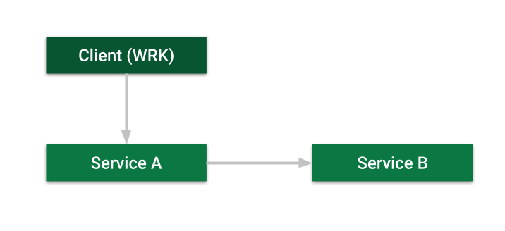

# Compare Node.js request modules
Let's compare performance (req/sec) of request modules on Node.js.

## Modules on test
| Module | res / sec |
| - | - |
| [request](https://www.npmjs.com/package/request) | 5,895 |
| [request-promise-native](https://www.npmjs.com/package/request-promise-native) | 5,621 |
| [got](https://www.npmjs.com/package/got) | 2,737 |
| [superagent](https://www.npmjs.com/package/superagent) | 3,434 |
| [axios](https://www.npmjs.com/package/axios) | 4,651 |
| [node-fetch](https://www.npmjs.com/package/node-fetch) | 3,175 |

## How I test

I did tests with c5.large AWS instance. I use three instances in the same region and the same AZ. I use WRK with 500 open connections to send GET requests to Service A. Service-A send a request to the Service-B and return JSON data.

Client
- Ubuntu Server 18.04 LTS
- wrk

Microservices
- Ubuntu Server 18.04 LTS
- Node v10.15.0 LTS
- PM2
- Express 4.16.4